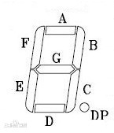

# 8 字型 LED 焊接

## 前置知识

1. [LED](../knowledge_base/led/README.md)
2. [电阻](../knowledge_base/resistor/README.md)

## 8字型LED 原理介绍

原理介绍：
我们将多个LED并联成一列，每个LED的阳极连接到一起，阴极的一端连接到单片机的IO口，那么我们就可以通过编程来自由控制LED所输出的数字的样式。

## 电路图

