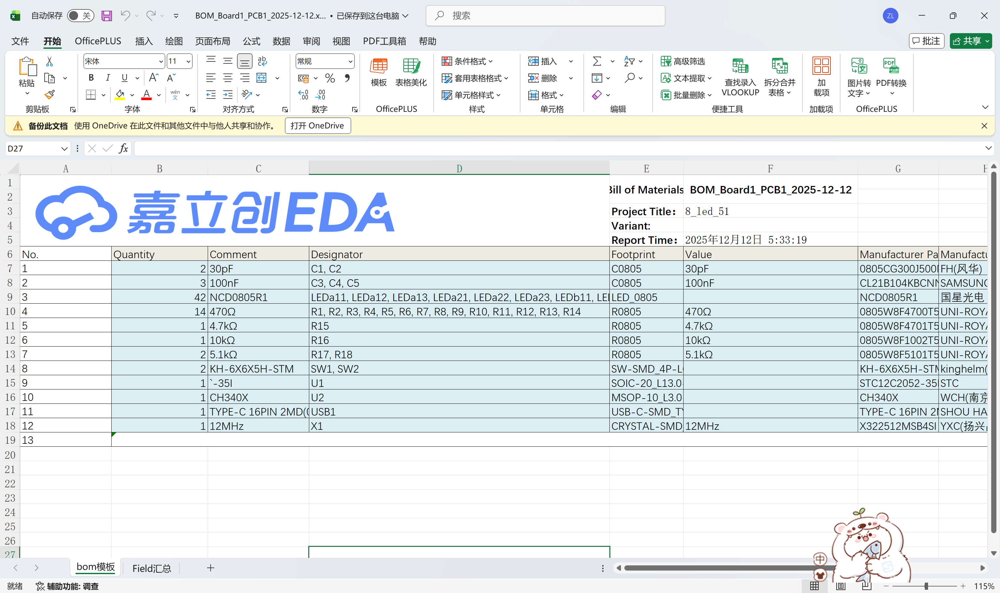
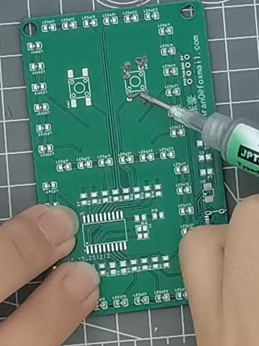
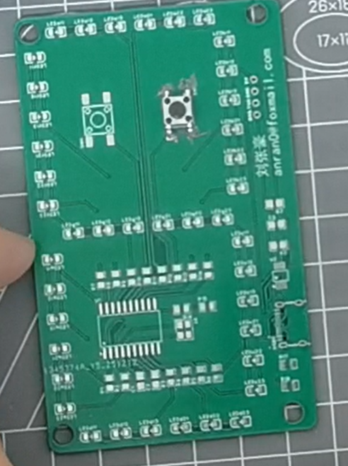
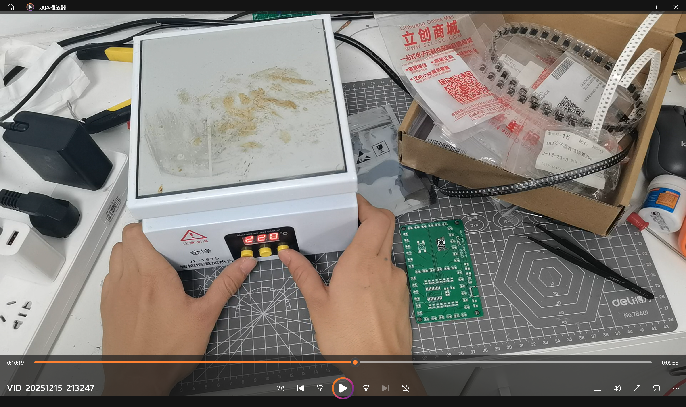
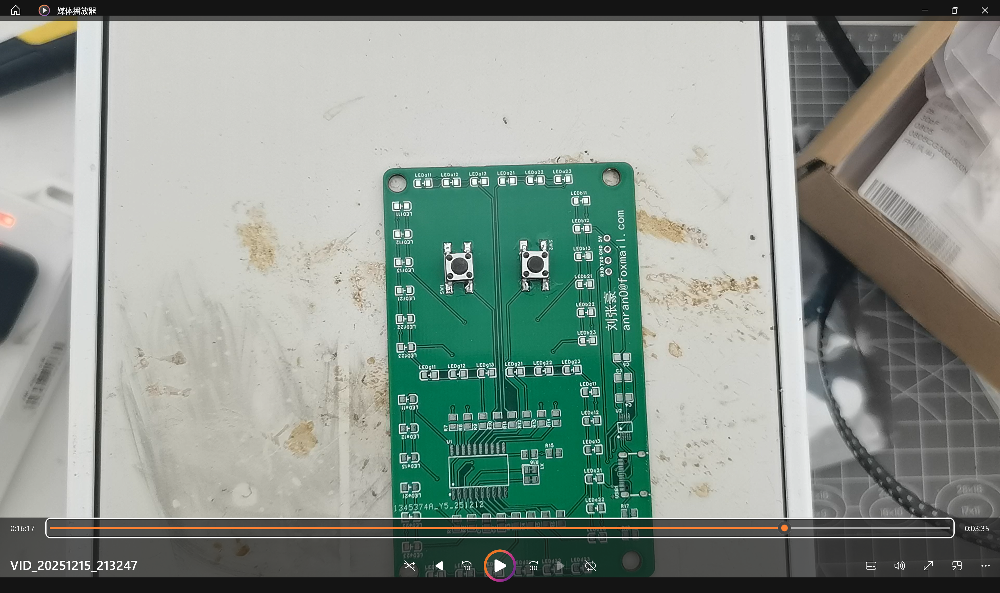

# 贴片元件的焊接

相关知识:  [贴片元件 (SMD Components)](../knowledge_base/smd_components.md) 

## 恒温台焊接

### 视频链接

: [贴片元件的恒温台焊接](https://www.bilibili.com/video/BV1kTqxBPEtp/)

<iframe src="//player.bilibili.com/player.html?bvid=BV1kTqxBPEtp&page=1" scrolling="no" border="0" frameborder="no" framespacing="0" allowfullscreen="true"> </iframe>

! [焊接视频跳转二维码](./img/video1.png)

### 焊接流程

1. 准备好焊接台、锡浆浆、贴片元件。
元件：
! [元件](./img/image1.png)
锡浆浆：
! [锡浆浆](./img/image2.png)
贴片元件：
! [贴片元件](./img/button.png)

2. 阅读bom表格，确认贴片元件的引脚连接情况。
bom 表格通常由pcb 绘制者提供  
通常包含以下pcb 上的元件信息

3. 将焊盘涂满锡浆浆。

4. 将贴片元件摆入焊盘中

> 即使放歪了也没事，锡融化的时候自动对齐

5. 预热恒温台，使恒温台达到预设的温度

> 恒温台温度应至少比锡浆浆的熔点高20°C  
> 如：我使用了183°C熔点的锡膏，熔点设置为220°C

6. 将PCB 放入恒温台。

! [PCB 放入恒温台](./img/image6.png)

7. 当锡浆浆熔化时，结束焊接
当锡浆浆表面光滑、形态圆润、元件位置位移到正常为止代表锡浆融化完成，结束焊接。

8. 焊接完成后，检查贴片元件是否正常工作。

! [检查贴片元件是否正常工作](./img/image8.png)

## 电烙铁焊接

操作繁琐，不建议手动焊接，仅仅用作补救使用。
不做相关文档编写，具体请看视频。

### 视频链接

: [贴片元件的电烙铁焊接](https://www.bilibili.com/video/BV1smqtByEPC/)

<iframe src="//player.bilibili.com/player.html?bvid=BV1smqtByEPC&page=1" scrolling="no" border="0" frameborder="no" framespacing="0" allowfullscreen="true"> </iframe>

