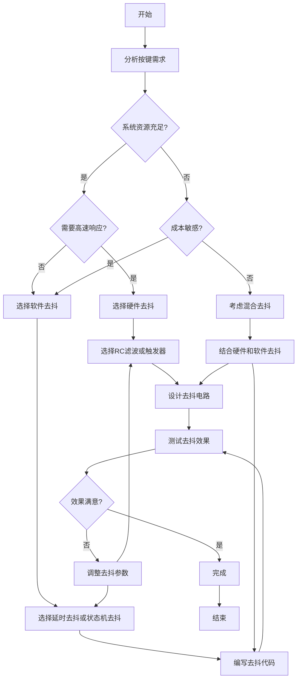
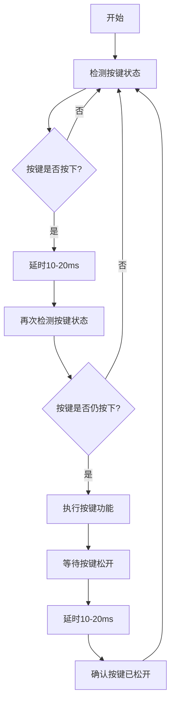
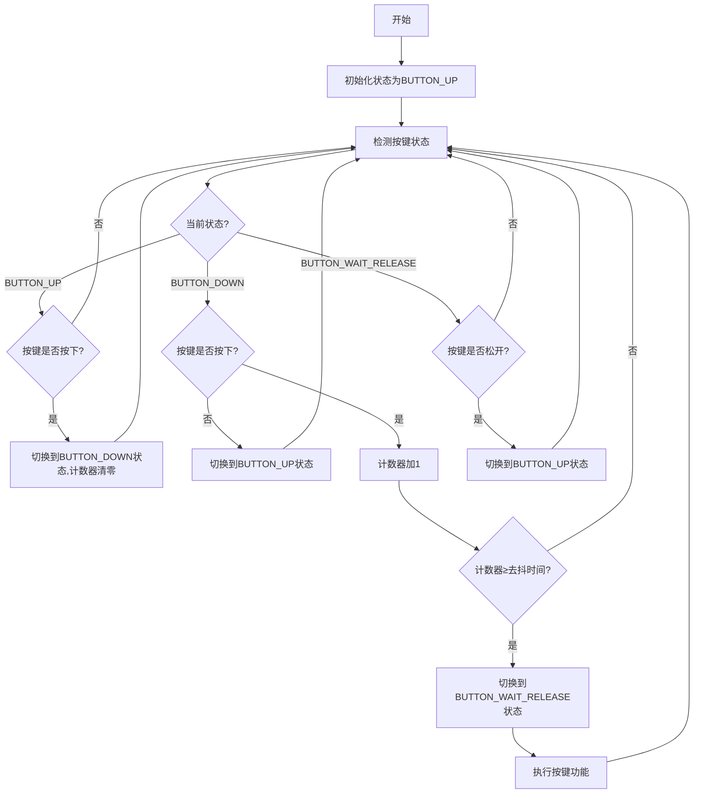
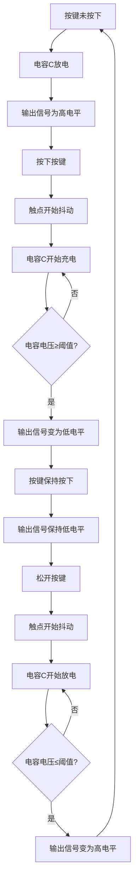

# 按键去抖流程图

## 1. 按键去抖方法选择流程

## 2. 延时去抖程序流程

## 3. 状态机去抖程序流程

## 4. 硬件RC滤波去抖电路工作流程

## 流程图说明

1. **按键去抖方法选择流程**：帮助用户根据系统资源、响应速度和成本要求选择合适的去抖方法
2. **延时去抖程序流程**：展示了最常用的软件延时去抖的实现过程
3. **状态机去抖程序流程**：展示了更高级的状态机去抖算法的工作过程
4. **硬件RC滤波去抖电路工作流程**：解释了RC滤波电路如何通过电容充电放电来消除抖动

这些流程图直观地展示了按键去抖的各个方面，从方法选择到具体实现，帮助用户更好地理解和应用按键去抖技术。