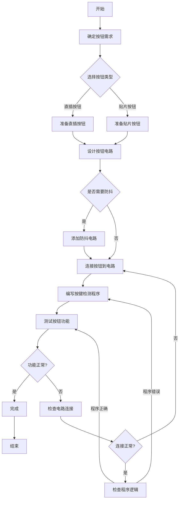

# 按钮使用流程图

## 流程图说明

1. **确定按钮需求**：明确按钮的用途（如开关、复位、选择等）和功能要求
2. **选择按钮类型**：根据电路设计选择直插或贴片按钮
3. **设计按钮电路**：设计按钮的连接方式（上拉或下拉电阻）
4. **是否需要防抖**：考虑是否需要添加硬件或软件防抖措施
5. **连接按钮到电路**：将按钮正确连接到电路板或面包板
6. **编写按键检测程序**：根据电路设计编写相应的按键检测代码
7. **测试按钮功能**：验证按钮是否能正确响应操作
8. **功能正常?**：检查按钮功能是否符合预期
9. **完成**：按钮安装和测试完成
10. **检查电路连接**：如果功能异常，首先检查电路连接是否正确
11. **连接正常?**：确认电路连接是否无误
12. **检查程序逻辑**：如果电路连接正常，检查程序逻辑是否有问题

这个流程图涵盖了按钮从需求确定到最终使用的完整流程，帮助用户系统地完成按钮的选型、连接和测试工作。