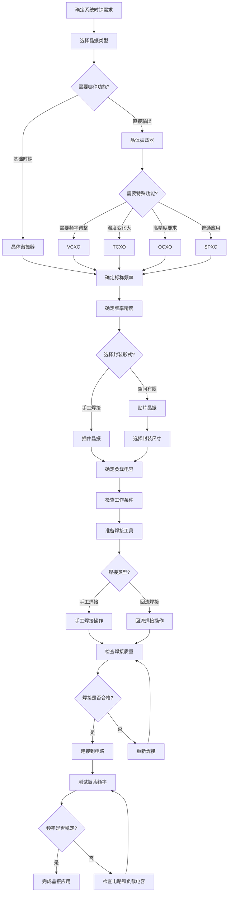

# 晶振元件选型与使用流程图

## 流程图说明

1. **确定系统时钟需求**：根据电子设备的功能要求，明确所需的时钟频率和精度
2. **选择晶振类型**：根据应用需求选择晶体谐振器或晶体振荡器
3. **确定特殊功能**：如果需要频率调整、温度补偿等特殊功能，选择相应类型的晶体振荡器
4. **确定标称频率**：根据系统设计要求选择合适的振荡频率
5. **确定频率精度**：根据系统精度要求选择合适的频率精度（ppm值）
6. **选择封装形式**：根据电路板空间和焊接方式选择贴片晶振或插件晶振
7. **确定负载电容**：根据电路设计要求确定合适的负载电容值
8. **检查工作条件**：确认晶振的工作电压、温度范围等参数是否符合应用环境
9. **焊接操作**：根据封装形式选择手工焊接或回流焊接
10. **质量检查**：检查焊接质量，确保无虚焊、短路等问题
11. **连接到电路**：将焊接好的晶振连接到电路中
12. **测试振荡频率**：使用频率计或示波器测试晶振的输出频率
13. **完成应用**：确认晶振工作正常后，完成整个应用过程

这个流程图展示了从系统需求分析到晶振应用的完整过程，适用于电子工程师和爱好者进行晶振的选型、焊接和测试操作。