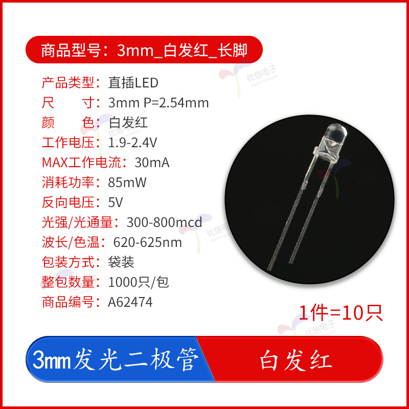
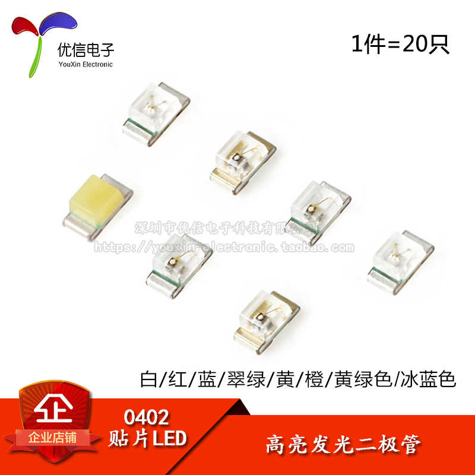
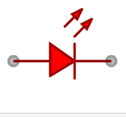

# LED

## 直插 LED

下图是一张市面上常见的直插 LED 小灯珠的规格图

在直插 LED 中，通常较短的引脚是阴极（Cathode），较长的引脚是阳极（Anode）。

## 贴片式 LED

下图是一张市面上常见的贴片式 LED 小灯珠的规格图

在贴片式 LED 中，通常区分阴极和阳极的方法：

| 方法名称 | 描述                                                  |
| -------- | ----------------------------------------------------- |
| 查看缺角 | 有一个小角缺掉一块的是是阴极                          |
| 查看焊盘 | LED 的阴极焊盘为了散热通常焊盘都会大一点              |
| 产品喷漆 | LED 通常 会为了标识会在阴极进行喷墨（如上图是绿色的） |

## 关于电路图

以下是常见的 LED 电路图

其中箭头指向的是阴极，箭头远离的是阳极。

## 关于串联电阻

以上图直插式 LED 为例 工作电压为 1.9-2.4V，工作电流为 30mA，那么我们如果想要直接将它接在大于 2.4V 的电源上，就需要串联电阻。

根据欧姆定律，电阻阻值与电压和电流成反比，即 R = V / I。

## 关于阴极和阳极

阴极连接到 GND（地），阳极连接到 VCC（电源正极）。

### 使用万用表测试阴极阳极
