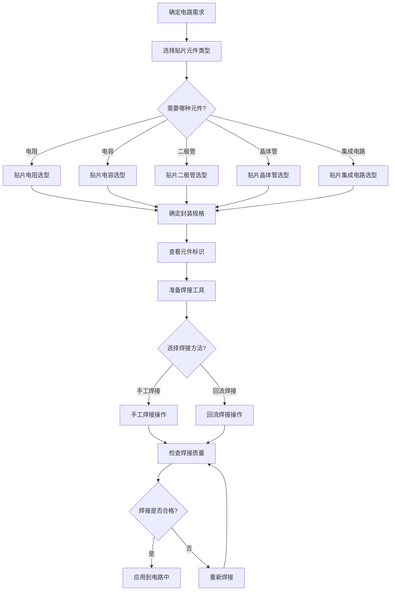

# 贴片元件使用流程图

## 流程图说明

1. **确定电路需求**：根据电路设计要求，明确所需元件的参数和功能
2. **选择元件类型**：根据电路需求选择合适的贴片元件类型（电阻、电容、二极管等）
3. **确定封装规格**：根据电路板空间和性能要求选择合适的封装尺寸
4. **查看元件标识**：识别元件上的标识，确认其参数是否符合要求
5. **准备焊接工具**：准备电烙铁、焊锡丝、助焊剂等焊接工具
6. **选择焊接方法**：根据生产规模选择手工焊接或回流焊接
7. **进行焊接操作**：按照焊接规范进行元件焊接
8. **检查焊接质量**：检查焊接是否有虚焊、短路等问题
9. **应用到电路中**：将焊接好的电路板应用到实际电路中

这个流程图展示了从电路需求分析到贴片元件应用的完整过程，适用于电子工程师和爱好者进行贴片元件的选型和焊接操作。